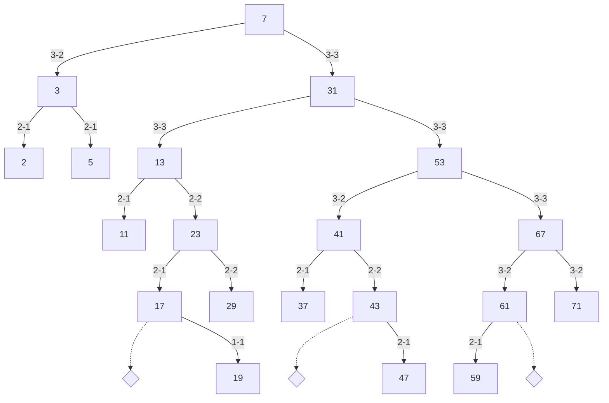
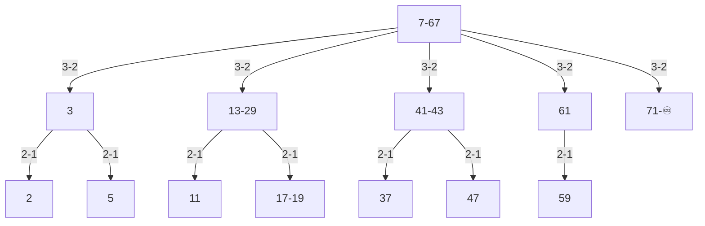
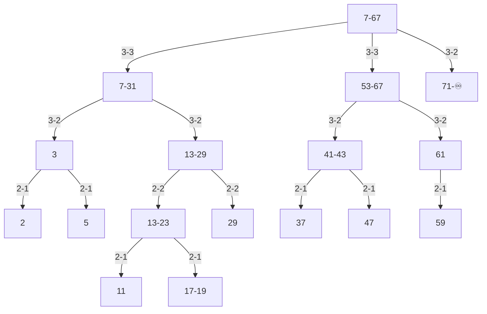

# max-k-tree

> A randomized self-balancing tree data structure.

## Table of Contents

- [Background](#background)
- [Install](#install)
- [Usage](#usage)
- [API](#api)
- [Contributing](#contributing)
- [License](#license)

## Background

This project includes an implementation of the zip-tree data structure, as well as an unbounded b-tree variant based on translating the zip-tree operations to trees of higher order.

A zip-tree is a randomized version of a balanced binary search tree, which relies on randomization (similar to "skip-lists") to maintain balance rather than strict structural properties. The zip-tree is a simple data structure, and is easy to implement and understand.



The equivalent unbounded b-tree implemented here is a self-balancing tree data structure that maintains sorted data and allows searches, insertions, and deletions in logarithmic time. The "unbounded" nature means that this b-tree variant doesn't have a fixed order (i.e., a maximum number of child nodes). This b-tree variant takes the concepts and methods used in zip-trees and applies them to trees of higher order.



A generalized variant of the higher-order tree, which we call a geometric-tree, is also implemented here. The geometric-tree enables creating trees with a maximum number of children. This bounded variant can be used to create a spectrum of probabilistic tree types, from binary, to a more traditional b-tree, to the unbounded b-tree variant shown above (and anything in between). The following figure shows a geometric-tree with a maximum of 2 + 1 children per node.



## Install

There are no external dependencies for this project, and it is written in pure Typescript with Deno in mind as the runtime. For now, simply clone the repo and import the code directly into your work. See usage below for an example.

## Usage

```ts
import { ZipTree } from "./zip_tree.ts";
import { assert, assertEquals, frozen, shuffle } from "./test_utils.ts";

const tree = ZipTree.from(frozen);
let root = ZipTree.empty();
for (const item of shuffle(frozen)) {
  root = root.insert(item);
}
assertEquals(root, tree);
assertEquals(tree.toArray(), frozen);
assertEquals(root.toArray(), frozen);

for (const item of shuffle(frozen)) {
  const node = tree.search(item.key);
  assertEquals(node, item);
}

for (const { key } of shuffle(frozen)) {
  assert(!root.isEmpty());
  root = root.remove(key);
}
assert(root.isEmpty());

console.log("ok");
```

## API

The API design is very much a work in progress, and will be updated as the project progresses. It is minimal at the moment, and for ease of translation, the APIs for the two implementations have been kept almost identical. The trees are immutable, and all "mutating" operations return a new tree. The trees are also persistent, and share structure where possible.

```ts
/**
 * A ZipTree is an immutable, probabilistically balanced tree with a geometric distribution of ranks.
 */
export interface ZipTree<K, R extends number> {
  /**
   * Check if the tree is empty.
   * @returns Whether the tree is empty.
   */
  isEmpty(): boolean;

  /**
   * Search for a key in the tree.
   * @param key The key to search for.
   * @returns The item with the given key if it exists in the tree, otherwise undefined.
   */
  search(key: K): Item<K, R> | undefined;

  /**
   * Insert an item into the tree.
   * @param item The item to insert.
   * @returns A new tree with the item inserted.
   */
  insert(item: Item<K, R>): ZipTree<K, R>;

  /**
   * Remove an item from the tree.
   * @param key The key of the item to remove.
   * @returns A new tree with the item removed.
   */
  remove(key: K): ZipTree<K, R>;

  /**
   * Split the input tree into two balanced sub-trees.
   * @param key The key to split the tree on.
   * @returns A tuple of the left and right trees.
   */
  unzip(key: K): [ZipTree<K, R>, ZipTree<K, R>];

  /**
   * Join another tree into this one.
   * @param other The other tree to join.
   * All of the keys in the other tree must be greater than the keys in this tree.
   * @returns A new tree with the two trees joined.
   */
  zip(other: ZipTree<K, R>): ZipTree<K, R>;

  /**
   * Return a string representation of the tree.
   * @returns A string representation of the tree.
   */
  toString(): string;

  /**
   * Return an Iterator over the items in the tree.
   * @returns An Iterator over the items in the tree.
   */
  [Symbol.iterator](): IterableIterator<Item<K, R>>;

  /**
   * Return an array of the in-order items in the tree.
   * @returns An array of the in-order items in the tree.
   */
  toArray(): Array<Item<K, R>>;
}
```

## Contributing

To get started, please fork this repository, and then clone it to your local machine. Once you have a local copy, you can run the tests, build the project, and run the example code:

```bash
git clone git@github.com:carsonfarmer/max-k-tree.git
cd max-k-tree
deno test
deno run example.ts
```

PRs accepted.

Small note: If editing the README, please conform to the [standard-readme specification](https://github.com/RichardLitt/standard-readme).

## License

MIT © Carson Farmer
